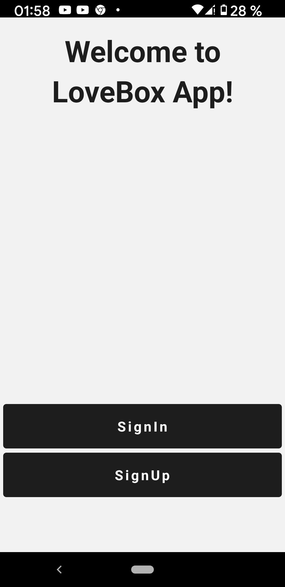
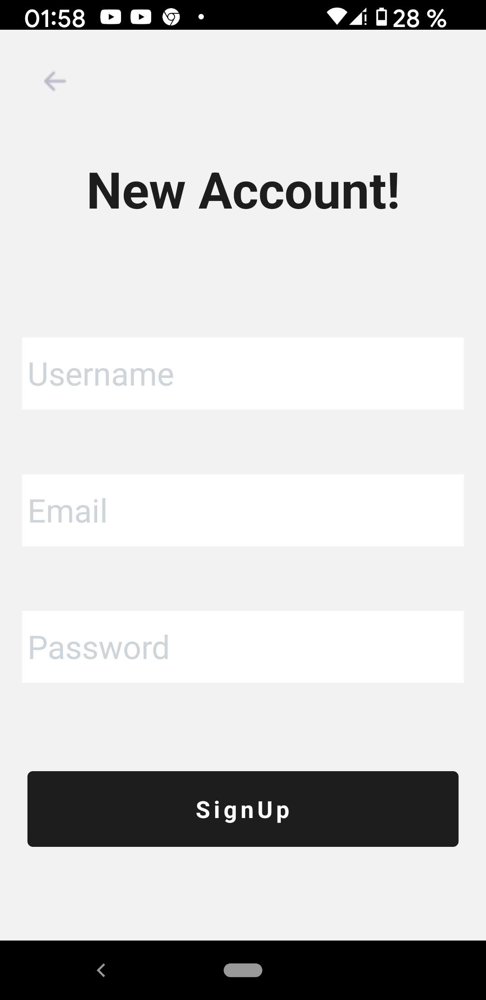
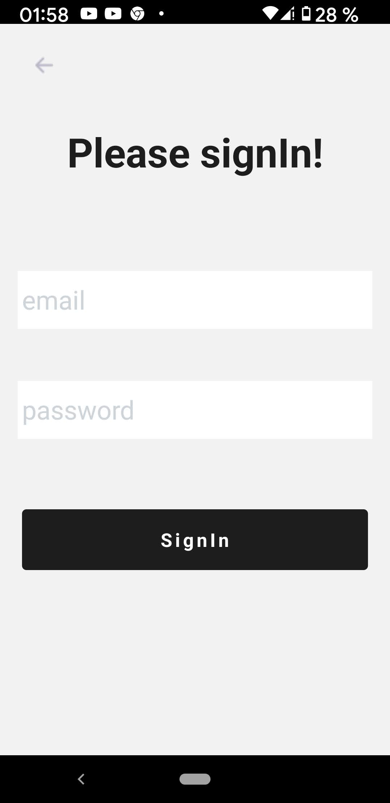
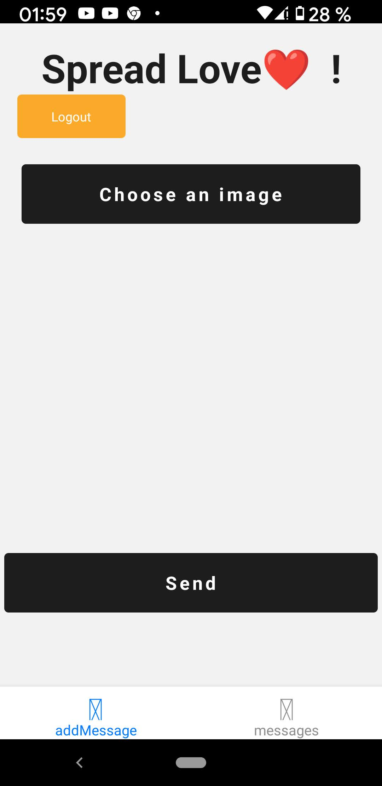
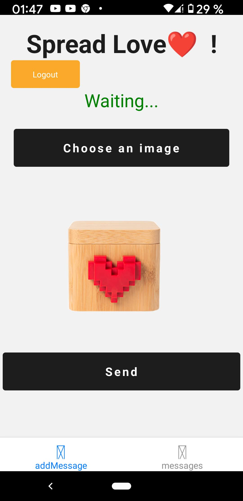
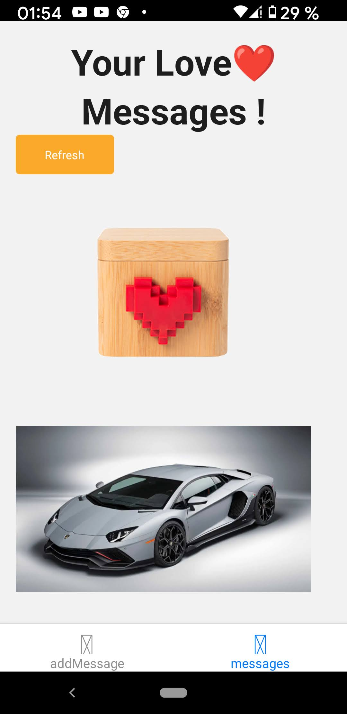

# Lovebox TA

Lovebox TA to send love messages and display the list of messages 
Using **React Native, Nodejs, GraphQL with Apollo Express Server**

### Description

### Requirements
##### Backend Nodejs
- Install `Redis` and `Nodejs` on your system.
- Install dependencies
    `npm install`
- Use the `.env.model`file to create a `.env` file to have your variables.
##### React Native App
- Install dependencies `yarn install`
  
##### Using docker
Not completed

## Features

- Register and login of the user
- Send a photo message to the backend
- get the list of messages (photos)
## Build and execution

### Launch the GraphQL server
To launch the backend just run : 
`npm run build:dev`
  `npm run dev`
Your server will listen on http://localhost:4002

### Launch the React Native App
- Start the metro bundler: `yarn start`
- Run on android: `yarn run android`

### Launch the tests
##### Server Side
Just run : `npm run test`
##### Client Side
Not implemented

## TODO

- [ ] Add more tests case
- [ ] Add server side input validation
- [ ] Finish docker implementation
- [ ] Add client side tests
- [ ] Add jwt token headers in context (client side)
- [ ] Use of Redux or MobX (Or more use of apollo cache)
